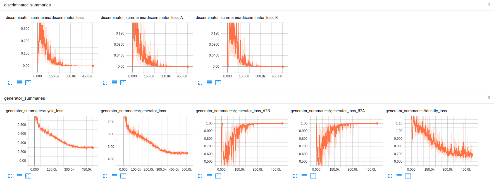

# Emotional Speech Conversion using Nonparallel Data

## Introduction

This is a tensorflow implementation of my paper Nonparallel Emotional Speech Conversion. It is an end-to-end voice conversion system which can change the speaker's emotion. For example, neutral to angry, sad to happy. The model aims at generating speech with desired emotions while keeping the original liguistic content and speaker identity. It first extracts acoustic features from raw audio, then learn the mapping from source emotion to target emotion in the feature space, and finally put those features together to rebuild the waveform. In our approach, three types of features are considered: 

### Features:
1. Fundamental frequency (log F_0), converted by logarithm Gaussian normalized transformation
2. Power envelope, converted by logarithm Gaussian normalized transformation
3. Mel-cepstral coefficients (MCEPs), a representation of spectral envelope, trained by CycleGAN
4. Aperiodicities (APs), directly used without modification

### Assumption and Loss
To fulfill the goal (change emotion, keep linguistic content & speaker identity), we consider the following loss functions:
1. Adversarial loss         (naturalness)
2. Cycle-consistency loss   (speaker identity)
3. Identity mapping loss    (linguistic information preservation)
4. Classification loss      (emotion correctness)

### Neural Network Representation
CycleGAN is a generative model developed for unpaired image-to-image translation. It assumes the existence of a cycle-consistency mapping that an image in the source domain mapped to a target domain and mapped back will be exactly the same as the original image. <br />
When applied for voice conversion, gated linear units (GLUs) are used as activation function to capture the sequential and hierarchical structures of speech.  It allows the information to be selectively propagated based on the previous layer states. The generator is 1D CNN focusing on temporal structure, and the discriminator is 2D CNN focusing on spectral texture. The model consists of the following architecture

<p align="left">
    
</p>


### Dataset: 
[IEMOCAP](https://sail.usc.edu/iemocap/) <br />
It has 10 professional US English speakers, five sessions, each has a dialog between one male and one female actor. The entire dataset has 12 hours of audiovisual data with 9 emotions (neutral, anger, happiness, excitement, sadness, frustration, fear, surprise, other). Since the task is to change emotion but keep the speaker identity, we build a sub-dataset as follows: <br />
Source emotional speech of actorX, ~100 sentences for training (A); ~32 sentences for evaluation (valA)  <br />
Target emotional speech of actorX, ~128 sentences for training (B); ~43 sentences for evaluation (valB)

The model learns two mappings: A2B (hap2neu) and B2A (neu2hap), and evaluation is conducted on three matrices:
1. emotional correctness
2. speech naturalness
3. speaker identity


### Toolbox for feature extraction and waveform reconstruction: 
[WORLD](https://github.com/mmorise/World)

## Files

```
.
├── Ablation_F0
├── figures
├── AblationF0.ipynb
├── check_train.ipynb
├── convert.py
├── model.py
├── module.py
├── README.md
├── train.py
├── utils.py
└── Vocoder.ipynb
```

## Usage

### Dependencies

* Python 3.5
* Numpy 1.15
* TensorFlow 1.8
* LibROSA 0.6
* FFmpeg 4.0
* [PyWorld](https://github.com/JeremyCCHsu/Python-Wrapper-for-World-Vocoder)

(Issue: wrong TensorFlow version --> export PYTHONNOUSERSITE=True) <br />
(Issue: wrong jupyter notebook python kernel --> Install the IPython kernel in different env)


### Train Model
Data preprocessing takes about 10 mins, depends on the data size. <br />
To have a good conversion quality, the training needs to take at least 1000 epochs. With a TITAN X, it takes 2 days to finish all 400K iterations. The learning rate is constant in iteration 0-200K and linearly drop to zero in 200K-400K. 

```bash
$ python train.py --help
usage: train.py [-h] [--train_A_dir TRAIN_A_DIR] [--train_B_dir TRAIN_B_DIR]
                [--model_dir MODEL_DIR] [--model_name MODEL_NAME]
                [--random_seed RANDOM_SEED]
                [--validation_A_dir VALIDATION_A_DIR]
                [--validation_B_dir VALIDATION_B_DIR]
                [--output_dir OUTPUT_DIR]
                [--tensorboard_log_dir TENSORBOARD_LOG_DIR]

Train CycleGAN model for datasets.

optional arguments:
  -h, --help            show this help message and exit
  --train_A_dir TRAIN_A_DIR
                        Directory for A.
  --train_B_dir TRAIN_B_DIR
                        Directory for B.
  --model_dir MODEL_DIR
                        Directory for saving models.
  --model_name MODEL_NAME
                        File name for saving model.
  --random_seed RANDOM_SEED
                        Random seed for model training.
  --validation_A_dir VALIDATION_A_DIR
                        Convert validation A after each training epoch. If set
                        none, no conversion would be done during the training.
  --validation_B_dir VALIDATION_B_DIR
                        Convert validation B after each training epoch. If set
                        none, no conversion would be done during the training.
  --output_dir OUTPUT_DIR
                        Output directory for converted validation voices.
  --tensorboard_log_dir TENSORBOARD_LOG_DIR
                        TensorBoard log directory.
```

For example, to train CycleGAN model for voice conversion between ``ang`` and ``neu``:

```bash
$ python train.py --train_A_dir ./../../../Database/Emotion/ang_neu/ang --train_B_dir ./../../../Database/Emotion/ang_neu/neu --model_dir ./model/ang_neu --model_name ang_neu.ckpt --random_seed 0 --validation_A_dir ./../../../Database/Emotion/ang_neu/val_ang --validation_B_dir ./../../../Database/Emotion/ang_neu/val_neu --output_dir ./validation_output --tensorboard_log_dir ./log
```
### Tensorboard

<p align="center">
    
</p>

We can listen to the converted audio in folder ``validation_output``, and compare with the original files in ``validation_A_dir`` and ``validation_B_dir``. 

### Emotional Speech Conversion

Convert speech with pre-trained models.

```bash
$ python convert.py --help
usage: convert.py [-h] [--model_dir MODEL_DIR] [--model_name MODEL_NAME]
                  [--data_dir DATA_DIR]
                  [--conversion_direction CONVERSION_DIRECTION]
                  [--output_dir OUTPUT_DIR]

Convert voices using pre-trained EmoCycleGAN model.

optional arguments:
  -h, --help            show this help message and exit
  --model_dir MODEL_DIR
                        Directory for the pre-trained model.
  --model_name MODEL_NAME
                        Filename for the pre-trained model.
  --data_dir DATA_DIR   Directory for the voices for conversion.
  --conversion_direction CONVERSION_DIRECTION
                        Conversion direction for CycleGAN. A2B or B2A. The
                        first object in the model file name is A, and the
                        second object in the model file name is B.
  --output_dir OUTPUT_DIR
                        Directory for the converted voices.
```

For test, put wav file in ``data_dir`` and run the following commands in terminal, the converted audio is in ``output_dir``:

```bash
$ python convert.py --model_dir ./model/ang_neu --model_name ang_neu.ckpt --data_dir ./../../../Database/Emotion/ang_neu/val_ang --conversion_direction A2B --output_dir ./converted_voices
```
The convention for ``conversion_direction`` is that the first object in the model filename is A, and the second object in the model filename is B. In this case, ``ang = A`` and ``neu = B``.

## Check Model
In check_train.ipynb, ...

## Ablation Study
1. Use F0
2. Use MCEP
3. Use power envelope

## Reference

* Takuhiro Kaneko, Hirokazu Kameoka. Parallel-Data-Free Voice Conversion Using Cycle-Consistent Adversarial Networks. 2017. (VCCycleGAN)
* Wenzhe Shi, Jose Caballero, Ferenc Huszár, Johannes Totz, Andrew P. Aitken, Rob Bishop, Daniel Rueckert, Zehan Wang. Real-Time Single Image and Video Super-Resolution Using an Efficient Sub-Pixel Convolutional Neural Network. 2016. (Pixel Shuffler)
* Yann Dauphin, Angela Fan, Michael Auli, David Grangier. Language Modeling with Gated Convolutional Networks. 2017. (Gated CNN)
* Takuhiro Kaneko, Hirokazu Kameoka, Kaoru Hiramatsu, Kunio Kashino. Sequence-to-Sequence Voice Conversion with Similarity Metric Learned Using Generative Adversarial Networks. 2017. (1D Gated CNN)
* Kun Liu, Jianping Zhang, Yonghong Yan. High Quality Voice Conversion through Phoneme-based Linear Mapping Functions with STRAIGHT for Mandarin. 2007. (Foundamental Frequnecy Transformation)
* [PyWorld and SPTK Comparison](http://nbviewer.jupyter.org/gist/r9y9/ca05349097b2a3926ec77a02e62c6632)
* [Gated CNN TensorFlow](https://github.com/anantzoid/Language-Modeling-GatedCNN)

## To-Do List

- [ ] Denoising and Source Separation
- [x] Vocoder comparison
- [ ] Learn the mapping of F0 and power envelope
- [ ] Different NN architecture and loss
- [ ] Hyper parameter tuning
- [ ] Ablation study of F0, MCEP and power envelope
- [ ] Train on more emotion pairs
- [ ] Objective and subjective evaluation
